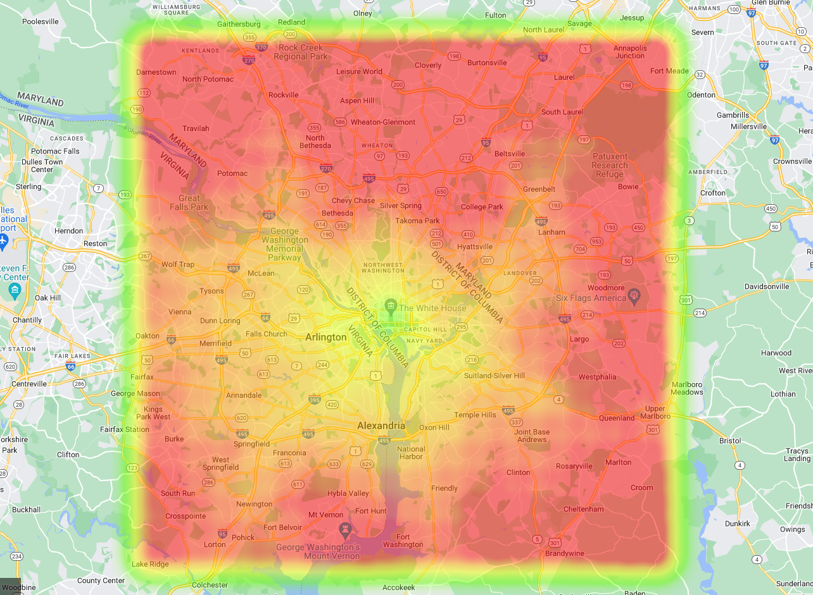

  

# Travel Time Heatmap

Create's a heatmap visualisation of the travel-times to a specific destination at a specific time.

## Design notes

### Heatmap generator

IN:
- Destination coordinates _(lat, long)_
- Density _(metres^2)_
    - The distance between each sample point
- Radius _(metres)_
    - Distance from the destination to sample points
- Close to roads _(boolean)_
    - Only sample points that have roads within the `closeRoadsDistance` amount.
- Close roads distance _(metres)_
- more TBD...

OUT:
- CSV file containing the point-data (is JSON better?) ((or JSON array ??))

https://stackoverflow.com/questions/58279818/to-optimise-performance-should-i-store-web-data-as-csv-or-json

### Google API

After the points have been generated, the next step is to fetch the travel time from google's maps api.

Request (google api request):
- Time of day ()'
- Point coordinates (lat, long)
- 

Response
- Est. travel time min
- Est. travel time max

### Visualisation

#### Heatmap

- Draw interpolated colours in the generated area, between the minimum and maximum travel times.
- Slider that lerps between the minimum and maximum travel time estimations from google (DEFAULTS: 0.5)
- Other data we get from google that we can display, traffic density, etc, etc??
